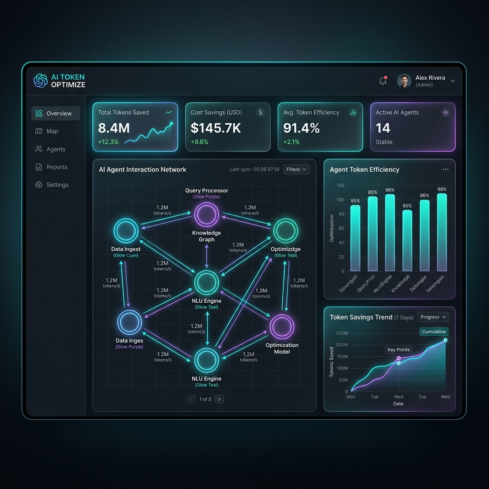

# Token for AI — Universal Token Optimization Engine & Context Layer

<p align="center">
  
  
</p>

**Token for AI** is a state-of-the-art Single Page Application (SPA) designed to serve as a local token optimization engine and context management layer for LLM (Large Language Model) interactions. It provides a real-time playground for compressing prompt content, running multi-agent workflows, managing long-term memory retrieval, and generating session snapshots to recover from context window limitations.

---

## 🚀 Core Features

### 1. Context Compression Engine
Toggles between 5 dynamic optimization levels:
- **Level 0 (Raw)**: Full context without modifications.
- **Level 1 (Structured Summary)**: Summarizes sections, retaining core headers (`#`), actions, list bullets, and primary constraints.
- **Level 2 (Compact Context)**: Applies regex replacements of common filler words and matches a custom dictionary of acronyms (e.g. `information` -> `info`, `context` -> `ctx`, `optimization` -> `opt`).
- **Level 3 (Essential Only)**: Strips minor articles (`the`, `a`), prepositions, and auxiliary verbs, replacing connectors with symbolic linkages (`->`, `&`).
- **Level 4 (Emergency Recovery)**: Formats prompt data directly into an active Session Snapshot checklist.

### 2. Multi-Agent Pipeline Simulator
Simulates the workflow of the 7 orchestration agents in real time:
- **Master Agent**: Identifies intent and routes execution paths.
- **Memory Agent**: Resolves relevant historical dependencies.
- **Token Agent**: Runs semantic compression rules.
- **Execution Agent**: Compiles code/text context.
- **Validation Agent**: Audits instructions for consistency and hallucinations.
- **Learning Agent**: Updates heuristic optimization thresholds.
- **Recovery Agent**: Auto-saves active transaction snapshots.

### 3. Adaptive Memory Retrieval Engine
Maintains a registry of memory blocks and calculates dynamic injection using the requested formula:
$$\text{Score} = \frac{\text{Relevance} \times \text{Priority} \times \text{Recency}}{\text{Token Cost}}$$
- Memories scoring above the threshold (`>= 0.25`) are highlighted in green and injected directly into the active model context.
- Decays the recency of older items as new memories are added to simulate standard cognitive retention curves.

### 4. Limit Expiry & Session Snapshot Recovery
- Visualizes token budget distribution (Execution Space vs Memory/Validation Reserves) and usage gauges.
- Generates structured markdown **SESSION SNAPSHOTS** when token limits are crossed.
- Supports restoring session states by pasting checkpoints back into the loader dialog to continue workflows seamlessly.

---

## 🛠️ Tech Stack & Design System
- **Core**: Vanilla HTML5 (semantic elements) and client-side JavaScript.
- **Styling**: Vanilla CSS3 (Tailwind-free), incorporating Outfit typography, dark mode HSL tailors, glassmorphism boundaries, responsive CSS grids, and SVG connector line dash animations.
- **Dependencies**: None. Works 100% offline.

---

## 💻 Getting Started

You can run the dashboard locally in two ways:

### Option A: Direct Launch
Simply double-click or open [index.html](file:///d:/current%20project/Token%20Optimization/index.html) directly in any modern web browser.

### Option B: Local HTTP Server (Recommended)
To run using a simple web server:
1. Open terminal and navigate to the project directory:
   ```bash
   python -m http.server 8000
   ```
2. Navigate to `http://localhost:8000` in your browser.
